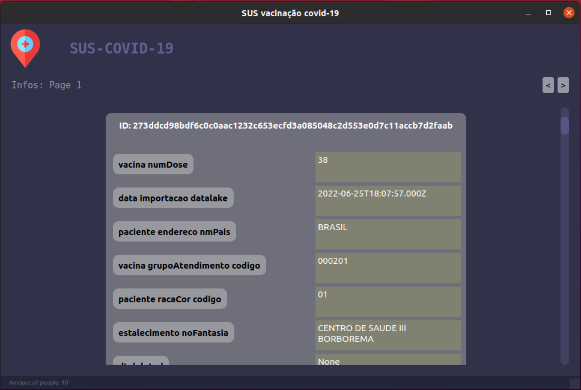

# SUS-Vacinação-COVD-19

Esse repositório foi criado no sistema operacional **LINUX**.

---
Este projeto foi realizou a construção de um sistema de GUI usando o Framework python __PyQt6__ para o consumo da API do SUS. Nessa API temos diversos campos preenchidos por pessoas reais.

## Informações sobre a API
A API disponibilizada pelo SUS, é uma ótima maneira de aprendizado para quem esta começando a criar sistemas com a utilização de APIs.

para mais informações consulte o site e o manual da API.
[Aqui!](https://dados.gov.br/dataset/covid-19-vacinacao "API SUS")

## Iniciando o sistema

#### Instalando o arquivo de requerentes.txt
Nesse arquivo serão encontrados todos os Frameworks e bibliotecas usados na construção do sistema

	pip install -r requerents.txt
Após a realização dos downloads digite o seguinte comando.

#### Iniciando o sistema

	python3 app.py

### Versões
Python: **3.10.0v**

## Autor
Criado por: __Hugo Rodrigues Pereira__